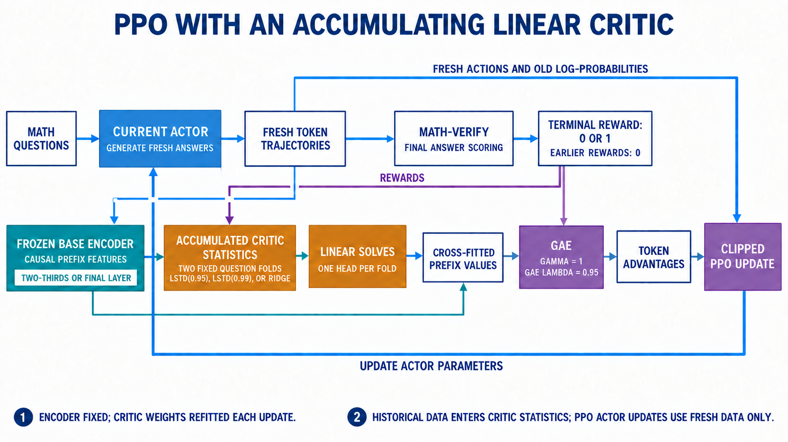
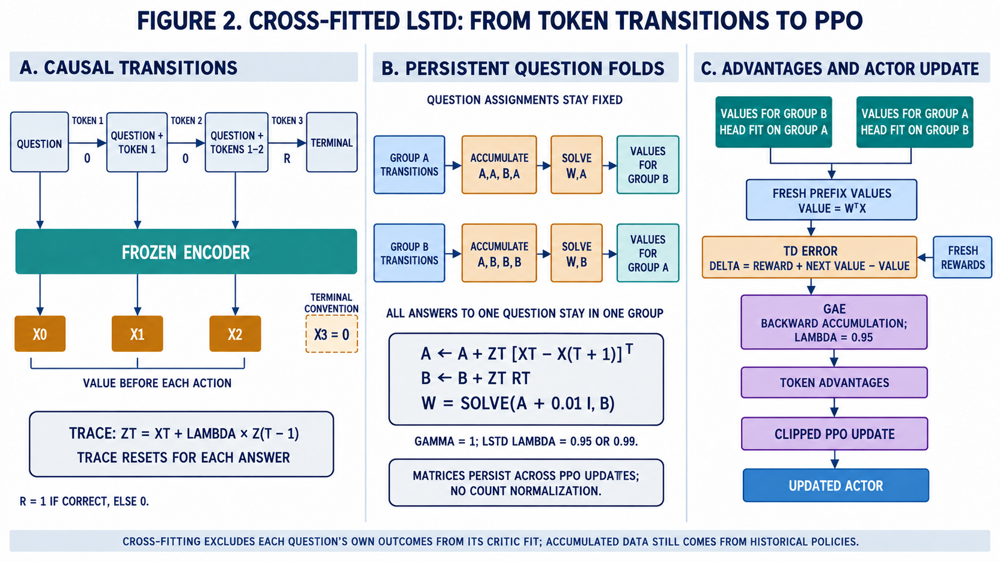

# Math RL: can PPO use a cheaper critic?

We want to improve a math-solving LLM with reinforcement learning while avoiding
PPO's usual second, large neural network for value prediction. Our candidate is a
small linear critic fitted to hidden features the actor already computes.

**Latest completed three-seed finding:** frozen-encoder, cumulative
PPO-LSTD(0.99) using two-thirds-layer features reached **61.22% mean MATH
accuracy**, versus **51.00%** for calibrated conventional PPO, at **3.594 versus
6.709 allocated GPU-hours/run** (about 46% less training compute). It had the
highest observed mean, but superiority over the other linear critics is not
established. GRPO was not included in this latest run.

[SETUP.MD](SETUP.MD) contains installation, phase-by-phase commands, monitoring
and resumption. This README explains the approach, completed results and their
limits. Results updated **2 October 2026**.

**Current status:** the layer/critic comparison is complete. Our selected design
uses ordinary completion prompts, Math-Verify, a permanently frozen base encoder
and accumulated LSTD(0.99) statistics at two-thirds depth, with no answer buffer.
A locked direct comparison with GRPO over five fresh training seeds is prepared,
not yet reported. The questions remain the inspected MATH split. Explicit
planning and the buffer are paused; AlphaProof-lite remains a proposed direction.

## One example, from tokens to reinforcement learning

Suppose the question is: **“I have 5 avocados and buy 4 more. Each serving needs 3.
How many servings can I make?”**

1. **Actor:** Qwen generates the answer one token at a time. Its action is the next
   token; its state is the question plus the answer written so far.
2. **Reward:** after generation, Math-Verify checks the final answer. A correct
   answer, 3, earns 1; an incorrect answer earns 0. It does not check every step.
3. **Critic:** after a prefix such as “There are 9 avocados…”, estimate the expected
   final reward if this policy continues. For binary outcomes this is a success
   probability, not a verdict on whether that particular sentence is correct.
4. **PPO:** combines rewards and value estimates into advantages using GAE, then
   adjusts the actor's token probabilities with a clipped policy objective.

Our conventional PPO baseline trains a separate transformer critic. We instead take Qwen's final
normalized hidden vector at the last prefix token, **before the next action**, and
fit a small head. The final answer and future tokens never enter that state vector.

**Ridge** fits each prefix directly to the eventual outcome. **LSTD(lambda)** fits
linear value-consistency equations across consecutive states using eligibility
traces. Both use the same features in our matched comparison. At lambda=1, our
complete episodic, gamma=1 setup matches ridge with the same regularization.
Solving TD equations accurately does not guarantee accurate values.

LSTD's critic-fitting lambda is separate from PPO's actor GAE lambda. GRPO, our
other infrastructure baseline, compares rewards across answers to the same prompt
without training a critic.

## Current architecture: frozen encoder and accumulated statistics



The current actor generates fresh answers. A separate, frozen copy of the base
encoder extracts causal prefix features at the selected layer. Rewards and
features update persistent critic statistics; fitted heads supply prefix values
to GAE. PPO changes the actor, not the encoder. The listed layers and fitting
methods are alternative experiment conditions, not an ensemble. The frozen
encoder requires an additional forward pass, included in compute accounting.



Each question stays in one fold. Group A fits the head that predicts values for
group B, and vice versa, including across historical updates. Values describe
the prefix before each action. Eligibility traces reset between answers while
matrices accumulate; terminal features are explicitly zero. In the diagram,
`X` includes the intercept, `ZT` denotes the eligibility trace at token `T`, and
`RT` denotes its reward. Critic lambda (0.95 or 0.99) is distinct from GAE lambda
(0.95). Cross-fitting prevents own-question fitting leakage; it does not make
historical-policy data on-policy.

Both figures are generated raster illustrations. The reusable
[generation prompts](docs/figures/image-prompts.md) and
[refinement prompts](docs/figures/refinement-prompts.md) are stored alongside them.

## What runs the experiment

- **Qwen/Qwen2.5-Math-1.5B base:** the actor, not the instruct model.
- **VERL + vLLM + PyTorch/FSDP:** RL coordination, generation and distributed updates.
- **Math-Verify:** final-answer scoring in a separate environment.
- **Duke Slurm:** GPU/CPU allocations and unattended jobs.
- **Our code:** prompts, reward integration, feature caches, critic fits and reports.

In online pilots, ordinary unparseable outputs receive zero reward. Offline critic
studies exclude answers without a usable verifier label. Thus their metrics are
**conditional on retained answers**. The online comparison scores ordinary parse
failures and verifier timeouts as zero for every method, retaining their status for
audit; infrastructure errors fail the run.

## Earlier result: calibrated PPO comparison completed

### Protocol and baseline selection

All four methods started from the same base Qwen model and identical initial test
scores: **157/300 correct (52.33%)**. Each method ran **60 updates × 64 answers =
3,840 training answers per seed**, across seeds **42, 43 and 44**: 12 completed
runs and 46,080 generated training answers in the final comparison. These are
repeated answers, not that many distinct questions. Evaluation used greedy
decoding on the same **300 MATH level 4/5 numeric-answer questions**.

We matched prompts, reward, response budget, actor optimizer settings and the
allocation of two GPUs. Each batch contained 16 questions × four answers.
Linear critics captured detached features from the current actor's existing
forward pass, fitted two heads on opposite question folds, and predicted values
without using the evaluated question's outcomes. Each update refitted the heads
on fresh answers: **no buffer and no reuse of offline critic weights**.

The discount was **gamma=1**, critic trace **lambda=0.99**, and PPO GAE
**lambda=0.95**. Both linear methods used fixed regularization **0.01** on
standardized features, leaving the intercept unpenalized. Rewards were binary and
terminal, with no KL shaping; EOS and the response cap were treated as terminal.
Raw linear values were not clipped or passed through a sigmoid.

Conventional PPO was calibrated separately on **200 validation questions**, using
seed 17 and 30 updates per candidate. It used a zero-initialized scalar head over
a trainable pretrained backbone, a persistent critic optimizer, detached raw GAE
return targets and mean loss over valid tokens per answer. Selection used
validation and health checks, not final test scores.

| Critic learning rate / fitting epochs | Initial validation | Final validation |
|---|---:|---:|
| 1e-5 / 2 | 51.5% | 49.5% |
| 5e-5 / 2 | 51.5% | 52.5% |
| **1e-5 / 4, selected** | **51.5%** | **54.5%** |

The selected `more_fitting` configuration was locked for all three final PPO
runs. Calibration cost an additional **8.860 training GPU-hours**, disclosed
separately. Only conventional PPO received this extra tuning budget. This is an
audited, validation-selected baseline, not a claim of optimal PPO tuning or an
exact paper replication. [Baseline protocol](docs/ppo_baseline.md).

### Accuracy and measured training cost

| Method | Mean final accuracy | Gain from base | Sample SD across seeds | Mean GPU-hours ↓ |
|---|---:|---:|---:|---:|
| Conventional PPO | 48.11% | −4.22 pp | 2.91 pp | 6.707 |
| PPO-ridge | 55.44% | +3.11 pp | **1.39 pp** | 3.505 |
| **PPO-LSTD(0.99)** | **59.67%** | **+7.33 pp** | 5.13 pp | 3.557 |
| GRPO | 58.22% | +5.89 pp | 2.22 pp | **3.445** |

SD describes seed variation; it is **not a confidence interval**. The three runs
reuse the same test questions, so they do not constitute 900 distinct questions.

| Seed | Conventional PPO | Ridge | LSTD(0.99) | GRPO |
|---|---:|---:|---:|---:|
| 42 | 51.33% | 57.00% | **65.33%** | 60.67% |
| 43 | 47.33% | 55.00% | **58.33%** | 56.33% |
| 44 | 45.67% | 54.33% | 55.33% | **57.67%** |

LSTD improved over the base in every seed, with net gains of **39, 18 and 9**
correct answers. It beat ridge in all three runs, and GRPO in two. Its particularly
strong seed 42 contributes substantially to its average lead.

### What the uncertainty permits us to say

The following differences use **2,000 paired seed/question bootstrap samples**.
Positive differences favor the first method. Intervals are descriptive,
exploratory and not adjusted for multiple comparisons.

| Comparison | Mean difference | Descriptive 95% interval |
|---|---:|---:|
| LSTD − conventional PPO | +11.56 pp | [+6.33, +17.11] |
| Ridge − conventional PPO | +7.33 pp | [+1.44, +12.89] |
| LSTD − ridge | +4.22 pp | [−1.11, +9.67] |
| LSTD − GRPO | +1.44 pp | [−3.44, +6.11] |

**Interpretation:** both cheap-critic systems outperform our calibrated
conventional PPO system in this experiment. LSTD's lead over ridge is encouraging
but still uncertain, even though it won each seed. The data establish neither
superiority nor equivalence against GRPO. Three seeds provide a limited view of
training variability; further gains cannot be inferred from the best run alone.

### Difficulty, cost and scoring checks

Mean final answer accuracy by difficulty:

| Method | Level 4: 152 questions | Level 5: 148 questions |
|---|---:|---:|
| Conventional PPO | 54.17% | 41.89% |
| Ridge | 64.91% | 45.72% |
| LSTD(0.99) | **66.23%** | **52.93%** |
| GRPO | 65.57% | 50.68% |

LSTD's larger gap over ridge on level 5 is a useful diagnostic, not proof that
longer reasoning caused the advantage. These subgroup means have not established
separate superiority claims.

- **Cost:** LSTD used about **47% less measured training compute** than conventional
  PPO, or **45% less** after subtracting PPO's estimated diagnostic-forward
  overhead. It cost **3.2% more than GRPO** and **1.5% more than ridge**.
- **Fitting:** LSTD fitting averaged **192.5 seconds across 60 updates**, about
  **3.0%** of training time. Ridge averaged **106.7 seconds**, about **1.7%**.
- **Accounting:** training includes generation, feature capture/transport, fitting,
  validation and checkpoints; it excludes setup, initialization and initial/final
  test evaluation. GPU-hours reflect allocated GPUs × elapsed training time.
  PPO's diagnostic overhead estimate was **0.187 GPU-hours per run**, leaving
  **6.520 GPU-hours** after subtraction. Calibration is additional.
- **Memory:** logged peak allocated memory was similar across methods. This
  experiment demonstrates time savings, not substantial GPU-memory savings.
- **Scoring:** final evaluations had **1–4 parse failures out of 300** each, with
  no verifier timeouts reported. Average truncation was **3.00% PPO, 4.44% ridge,
  3.56% LSTD and 4.89% GRPO**, versus 7.67% initially. Ordinary parse failures or
  excess truncation do not explain PPO's poor result; silent scoring mistakes
  still require a human audit.

### Why PPO's health checks are not a success guarantee

Every conventional PPO run passed checks for completion, finite values, nonzero
updates, zero initial values and improved fitting to its training targets.

| Seed | Mean target MSE before critic update | After | Reduction |
|---|---:|---:|---:|
| 42 | 0.00740 | 0.00375 | 49% |
| 43 | 0.00702 | 0.00393 | 44% |
| 44 | 0.00721 | 0.00387 | 46% |

The critic was fitting its **bootstrapped training targets**, yet final actor
accuracy regressed in every seed. These checks do not measure held-out value
accuracy or establish useful advantages, and they do not rule out every
implementation or tuning problem. The cause of the regression remains unresolved.

The comparison changes complete critic systems: architecture, fitting targets,
persistence and cross-fitting differ. It cannot attribute the entire advantage
to LSTD alone or establish that conventional PPO is generally inferior.

**Finding to carry forward:** a cheaply fitted linear critic supported consistent
PPO improvement at approximately GRPO's training cost. LSTD achieved the highest
mean accuracy; superiority over ridge or GRPO remains unproven. Results are from
an inspected test split with an incomplete independent reward audit, not an
untouched benchmark.

## Earlier experiments: how we got here

### Phases 0–3: working RL, not proven improvement

We established generation, backpropagation and checkpoint saving. Plain completion
prompts worked better than chat prompts for this base model. Replacing our strict
format parser with Math-Verify recovered credit for correct answers. The fresh
200-answer audit remains incomplete: only 10 were reviewed, all in agreement.
Checkpoint save/resume equivalence is also not yet established.

The PPO and GRPO pilots each ran ten training iterations: **160 generated answers
for PPO, 320 for GRPO**. These were not equal sampling budgets. On the same 500
held-out questions with greedy decoding:

| Model | Correct | Accuracy |
|---|---:|---:|
| Base Qwen | 423/500 | 84.6% |
| PPO/GAE | 424/500 | 84.8% |
| GRPO | 424/500 | 84.8% |

**Interpretation:** the machinery works; one extra correct answer is not convincing
learning evidence. These questions were held out from our training, not necessarily
from Qwen's pretraining.

### Phase 4: do hidden states contain useful value information?

We froze Qwen and generated **80,000 answers** across 4,000 training, 500 validation
and 500 test questions. We retained **77,351** and cached every response-prefix
state. Supervised heads used eight sampled prefixes per retained answer, including
the question-only state. Splits were by question, not by answer.

| Head | Test Brier ↓ | Correctness-prediction accuracy |
|---|---:|---:|
| Constant baseline | 0.23054 | — |
| One-layer sigmoid head | 0.19268 | 71.3% |
| Two-layer MLP | **0.18888** | **71.8%** |
| Ten-layer residual network | 0.18977 | 71.6% |
| Raw linear head, gradient fitted | 0.19521 | 71.1% |
| Direct ridge | 0.19419 | 71.2% |

Brier is mean squared error against binary outcomes; lower is better. These accuracy
numbers measure **prediction of answer correctness**, not Qwen's math accuracy.

**Interpretation:** linear features are useful and close to larger heads. Ridge
fitting/tuning took about 32 seconds, but that excludes generation and feature
extraction. An early undertrained linear head performed badly; longer fitting and
validation-based stopping corrected that. Parser failures later interrupted data
collection; resumable caches and explicit answer exclusions preserved progress.

### Phases 5–7: LSTD needs a long trace in this setting

We fitted LSTD and matched ridge on **61,876 training answers / 20,931,480 token
transitions**. Both used all consecutive training states; evaluation kept the same
sampled prefixes. Regularization and lambda were selected on validation only.

| Method | Original GSM8K test Brier ↓ |
|---|---:|
| LSTD(0) | 0.22889 |
| LSTD(0.90) | 0.22124 |
| LSTD(0.99) | 0.20222 |
| **LSTD(0.999)** | **0.19751** |
| LSTD(1) / matched ridge | 0.19845 |

**Interpretation:** LSTD(0) solved its equations accurately but predicted poorly.
Lambda=0.999 offered a small advantage; lambda=1 matched ridge as expected. This
ridge result differs from Phase 4 because the fitting weights/protocol differ.

A new generation seed on the **same 500 test questions** reproduced the advantage:
0.19790 versus 0.19887; paired question difference **−0.00098**, descriptive 95%
interval **[−0.00146, −0.00050]**. GSM8K length diagnostics favored medium-length
answers, not the longest.

### Phase 8: transfer to harder MATH

Without refitting, the GSM8K critics were evaluated on **148 MATH-500 level 4/5
questions**, restricted to text-only integer/decimal answers. Of 2,368 answers,
2,278 were retained.

| Critic | Brier ↓ | Correctness-prediction accuracy |
|---|---:|---:|
| LSTD(0.999) | **0.20232** | **69.7%** |
| Ridge | 0.20886 | 69.2% |

The paired difference was **−0.00650**, interval **[−0.00887, −0.00411]**. The
advantage was clear on level 4; the level-5 interval included zero. Answers longer
than 512 tokens favored LSTD, with paired difference **−0.00909**. Question-only
predictions showed no clear advantage.

**Interpretation:** encouraging transfer, particularly during longer answers, but
not proof that deeper reasoning causes the benefit. Level-5 truncation was 7.6%;
90 answers were excluded, and reward auditing remains necessary.

### Phase 9: fitting directly on MATH

With the actor frozen, we fitted on **15,346 retained training answers / 11,685,978
token transitions** and evaluated on **300 MATH level 4/5 test questions**. MATH-500
was excluded; lambda and regularization were selected on validation only.

| Critic | Test Brier ↓ | Correctness-prediction accuracy |
|---|---:|---:|
| LSTD(0) | 0.22304 | 66.1% |
| LSTD(0.90) | 0.21715 | 66.1% |
| LSTD(0.99) | 0.19716 | 69.0% |
| LSTD(0.999) | 0.18574 | 71.4% |
| **LSTD(1) / ridge** | **0.18566** | **71.6%** |

**Interpretation:** validation selected lambda=1 and zero regularization. The two
fits then match algebraically, not just statistically. LSTD's earlier transfer
advantage did not translate into an advantage when fitting directly on MATH.
Ridge remains a strong, simpler candidate. Level-5 truncation was 6.9%, and the
metrics exclude unparseable answers. Unknown difficulty labels initially stopped
loading; recording and excluding those labels fixed the loader.

### Phase 10: lower-lambda stress test

This experiment reused the saved new-seed GSM8K and MATH transfer answers. Each
method's regularization was selected on GSM8K validation only.

| Critic | New-seed GSM8K Brier ↓ | MATH transfer Brier ↓ |
|---|---:|---:|
| LSTD(0.85) | 0.22348 | 0.30172 |
| LSTD(0.90) | 0.22113 | 0.29338 |
| LSTD(0.95) | 0.21585 | 0.27263 |
| LSTD(0.999), earlier matched evaluations | **0.19790** | **0.20232** |
| Ridge | 0.19887 | 0.20886 |

All three lower-lambda paired intervals favored ridge. At lambda=0.85/0.90,
accuracy was 64.0% on GSM8K and 32.9% on MATH, versus ridge's 70.9% and 69.2%.

**Interpretation:** LSTD is not generally better. Near-return-regression LSTD is our
promising variant; stronger short-range bootstrapping was harmful here. These
are exploratory results on repeatedly inspected sets. Intervals are descriptive,
not adjusted for multiple comparisons. Raw Brier across datasets also depends on
their success rates; compare methods within each dataset.

### Phase 11: initial single-seed online pilot

We tested whether the small critics help **learning**, not just prediction.
All four methods started from the same base Qwen and used the saved MATH level 4/5
numeric question splits, Math-Verify reward and token budgets.

| Method | How it produces advantages |
|---|---|
| Conventional PPO | Separate trainable transformer critic + GAE |
| PPO-ridge | Linear return regression on actor features + GAE |
| PPO-LSTD(0.99) | Linear TD trace solve on actor features + GAE |
| GRPO | Relative rewards among four answers to each question |

Each update generated **16 questions × 4 answers = 64 answers** for every method.
The completed pilot ran 30 updates (**1,920 training answers per method**), with
seed 42, sequentially on the same two GPUs. Greedy evaluation used the same 300
test questions before and after training; initial correctness scores were identical.

| Method | Final correct | Accuracy | Gain from 52.3% base | Training minutes ↓ | Allocated GPU-hours ↓ |
|---|---:|---:|---:|---:|---:|
| Conventional PPO | 157/300 | 52.3% | 0.0 pp | 78.3 | 2.611 |
| PPO-ridge | 174/300 | 58.0% | +5.7 pp | 54.3 | 1.809 |
| **PPO-LSTD(0.99)** | **180/300** | **60.0%** | **+7.7 pp** | **54.6** | **1.821** |
| GRPO | 181/300 | 60.3% | +8.0 pp | 53.2 | 1.775 |

**What went well:** LSTD-PPO fixed 39 base-model errors and introduced 16 new
errors, a net gain of **23 correct answers**. Its paired comparison against the
base gave p=0.0027; against conventional PPO, p=0.0052. LSTD fitting took only
**81.5 seconds across all 30 updates**, about 2.5% of its measured training time.
Test truncation fell from 7.7% to 2.0%.

**What remains unresolved:** LSTD's six-answer lead over ridge had p=0.42, and
its one-answer deficit to GRPO had p=1.0. These do not establish an advantage or
equivalence. Conventional PPO fixed 27 answers and broke 27: unchanged accuracy
does not mean unchanged weights or prove that a better-tuned baseline cannot learn.

Training costs include generation, feature transport, fitting, validation and
checkpointing; they exclude setup, initialization and initial/final test evaluation.
Thus the 30% saving is for this measured training workload, not an isolated solver
speedup. Logged peak memory was similar across methods; no memory saving is shown.

In this completed pilot, each iteration of the two linear methods captures detached, pre-token features
from the actor's existing log-probability forward pass. Two question folds ensure
an answer's own reward is never used to fit its value predictions. We fit new
heads on the current batch and discard them after the update: **no buffer
and no reuse of the offline weights**. The saved offline run supplies the question
split and model identity, not old-policy training answers.

LSTD's trace is **0.99**, as requested; all PPO variants use actor GAE lambda=0.95.
Both linear fits use fixed regularization 0.01 because these batches are much
smaller than the offline dataset; this is a declared pilot setting, not a tuned
winner. Conventional PPO keeps its critic optimizer across updates. All actors
use the same PPO loss and optimizer settings.

**Interpretation:** this supports our central idea: a cheaply fitted linear critic
can support useful PPO learning. Offline, LSTD(0.99) predicted less accurately
than ridge; online, it achieved the higher score in this pilot. Value-prediction
error alone therefore does not determine which critic will help PPO most.

This compares complete critic systems, not just solvers: conventional PPO also
differs in architecture, targets, persistence and cross-fitting. Test questions
were already inspected offline, the reward audit remains incomplete, and all
p-values are exploratory and unadjusted. The completed comparison above adds three-seed replication and conventional
PPO calibration; changed-answer auditing and untouched evaluation remain needed. Commands are in
[SETUP.MD](SETUP.MD#phase-11--online-ppo-lstd-ridge-conventional-ppo-and-grpo).

### Buffer experiment — completed; buffer paused

We tested a buffer of up to 256 answers, 131,072 transitions and four updates of
history. A frozen base encoder kept stored features consistent. The no-buffer
controls used that **same frozen encoder**. Both runs completed successfully.
Each method used seed 42, 30 updates × 64 answers and a 300-question test set.
All started at 52.3% accuracy; training costs include fitting and feature passes.

| Method | Final answer accuracy | Training GPU-hours |
|---|---:|---:|
| Conventional PPO | 51.0% | 2.598 |
| Ridge, no buffer | 56.7% | 1.849 |
| Ridge + buffer | 56.3% | 1.947 |
| LSTD(0.99), no buffer | **57.7%** | 1.865 |
| LSTD(0.99) + buffer | 57.3% | 2.043 |
| GRPO | **57.7%** | **1.779** |

**Interpretation:** the buffer cost about 5% more for ridge and 10% more for
LSTD, with one fewer correct answer out of 300 for each. That tiny accuracy
change does not establish harm, but there is no demonstrated benefit. LSTD
without the buffer matched GRPO's aggregate accuracy at about 5% greater cost.
This is one seed on inspected questions, not proof of equal performance.

These pilot results motivated the completed calibration and three-seed
comparison above. Conventional PPO's regression remains unresolved even after
that calibration.
These frozen-feature runs also differ from the initial actor-feature pilot;
do not attribute differences between those pilots solely to the buffer.

### Phase 12: explicit planning — paused

Our final screen compared ordinary staged solving with **facts → plan → solution
→ final answer**, using the frozen base model on 100 previously inspected MATH
validation questions, four answers per condition (800 attempts). Python inserted
headings and imposed per-stage budgets; Math-Verify scored only the final section.
No critics were fitted and no policy updates occurred. Runtime: **1 hour 42 minutes**.

| Condition | Answer accuracy | Mean generated tokens | Any stage hit its cap |
|---|---:|---:|---:|
| Staged control | 77/400 — **19.25%** | **582.4** | 38.8% |
| Staged planning | 58/400 — **14.5%** | **772.7** | 98.8% |

Planning lost **4.75 percentage points** (exploratory paired 95% interval
**[−9.5, −0.25]**) while using about **33% more tokens**. Facts and plans usually
hit their 96-token caps. Inspection showed duplicated headings, unfinished
expressions, instruction repetition and topic drift. The cap rate means *any
section* exhausted its allowance, not the full 2,048-token budget. These scores
are not directly comparable to Phase 11's different evaluation protocol.

**Interpretation:** this staged protocol did not help this 1.5B base model.
Instruction-following limitations, noisy text and forced boundaries are plausible
contributors; the experiment does **not** establish a parameter-count ceiling or
show that planning cannot help a reasoning-trained model. We return to Phase 11's
ordinary-completion pipeline. Planning code and outputs remain as historical
experiments, not prerequisites for further PPO work.

## Pre-prover follow-up studies: results and closing comparison

Three ablations extend the completed comparison before formal proof search. The layer and accumulation/refresh studies have now completed:

| Study | Comparison | What it tests |
|---|---|---|
| Critic layer depth | Outputs around one-third, two-thirds and final depth | Where outcome-predictive features are available |
| Cumulative LSTD(0.99) | Fixed base encoder, fresh-batch versus accumulated raw matrices | Whether retaining historical sufficient statistics helps PPO |
| Encoder refresh | Never reset, reset only, or copy actor and reset together | Whether periodically updated representations help beyond discarding stale history |

### Layer depth: same data, different representations

The layer study reuses saved answers and identical prefix positions at approximately
one-third, two-thirds and final model depth. It fits the same supervised heads with
matched budgets and validation-only tuning. Intermediate features are block
outputs; final features include Qwen's final RMSNorm. This tests those extraction
conventions, not depth independently of normalization.

| Head | Final-layer Brier | Two-thirds Brier | Final / two-thirds prediction accuracy |
|---|---:|---:|---:|
| Linear logistic | 0.18378 | **0.17518** | 72.5% / 74.1% |
| MLP2 | 0.18181 | **0.17525** | 73.1% / 74.0% |
| ResNet10 | 0.18305 | **0.17583** | 72.8% / 73.9% |
| Linear value | 0.18644 | **0.17751** | 72.5% / 74.1% |
| Ridge | 0.18514 | **0.17714** | 72.6% / 74.2% |

Two-thirds features improved every head; all five descriptive paired Brier
intervals excluded zero. These are outcome-prediction results, not PPO gains.

The accumulation study found 59.67% actor accuracy with fresh-batch matrices
versus 58.56% with cumulative matrices (difference -1.11 pp, interval
[-5.33, 3.56]). The separate refresh study found 60.89% for permanently frozen
cumulative features, 58.22% for resets alone, and 56.89% for refresh plus reset.
All refresh comparisons included zero; costs were about 3.6 GPU-hours/run.
The repeated cumulative control varied between studies, so these do not establish
a winner. **Our design choice is nevertheless to proceed with accumulation and
a permanently frozen encoder**, not to claim that it has proven superior.

### Closing online comparison: depth and critic target

The completed `layers` study compared conventional PPO (the previously
validation-selected `more_fitting` profile) with six linear-critic variants:
Ridge, LSTD(0.95), and LSTD(0.99), each using two-thirds or final features.
No GRPO run is added in this requested comparison; its earlier results remain
context, not a newly matched control.

Each condition starts from the same base actor. Linear heads start with zero
statistics, load no offline fitted weights, never refresh the encoder, and never
reset the matrices. All use 60 updates, 64 generated answers/update, the same
three seeds, question folds, reward, evaluation and raw-sum epsilon=0.01.
Ridge accumulates `A += phi.T @ phi` and `b += phi.T @ returns`; LSTD accumulates
eligibility-trace TD statistics. No iterative head-training budget favors one
layer: both receive the full same rollout budget and an exact linear solve at
every update. Policies may diverge, so generated trajectories and token counts
need not match. Both extraction paths execute the whole frozen backbone and
include that cost. Intermediate and final feature scales differ; shared raw
regularization is a specified control, not normalization-invariant tuning.

This can close the pre-prover phase, but it is still an exploratory study on
inspected questions. A final independent generalization claim would require an
untouched evaluation set and a completed reward audit. Run instructions are in
[SETUP.MD](SETUP.MD#closing-comparison-cumulative-frozen-critics-at-two-depths).


### Completed online layer study

| Method | Mean answer accuracy | Training GPU-hours/run |
|---|---:|---:|
| Conventional PPO | 51.00% | 6.709 |
| Ridge, two-thirds | 57.78% | 3.619 |
| LSTD(0.95), two-thirds | 58.22% | 3.590 |
| **LSTD(0.99), two-thirds** | **61.22%** | **3.594** |
| Ridge, final | 57.67% | 3.594 |
| LSTD(0.95), final | 56.56% | 3.588 |
| LSTD(0.99), final | 60.33% | 3.567 |

All six linear variants accumulated raw statistics with epsilon=0.01, frozen
encoders, persistent question folds, no resets and no offline head initialization.
The LSTD(0.99) two-thirds minus PPO accuracy difference was +10.22 percentage
points, with descriptive paired seed/question interval [3.11, 17.67]. Its
advantage over same-layer Ridge was +3.44 pp [-2.34, 9.44], and over the final-layer
LSTD(0.99) was +0.89 pp [-3.00, 4.78]. The stronger offline two-thirds features
therefore did not establish a reliable online layer advantage. These are three-seed,
inspected-test, unadjusted exploratory comparisons of complete critic systems.
The experiment supports lower-cost useful critics here; it does not establish
that accumulation itself causes the gains or that LSTD beats GRPO.

### Final direct comparison with GRPO: locked protocol, results pending

We carry forward LSTD(0.99), two-thirds features, frozen base encoder, cumulative
raw matrices and epsilon=0.01 as a design choice. The `grpo_final` study runs it
against GRPO from the same base actor for 60 updates × 64 answers, with five fresh
training seeds (101–105). Each LSTD run starts from zero statistics. Both methods
use the same questions, actor settings, decoding, reward and final greedy test;
there is no new tuning or best-checkpoint selection. Run order alternates by seed.

The single primary comparison is final LSTD minus GRPO accuracy. Report every
seed, its paired difference, a descriptive paired seed/question interval, and
costs including frozen feature extraction and fitting. Additional accounted
costs include initialization and base/final evaluation; environment setup and
queue time are outside that accounting. Per-level scores, truncation, verifier
statuses and all paired test responses are exported for auditing. Review both
flagged disagreements and a random sample of agreements before a final claim.

This is an equal-rollout-budget comparison, not an equal-time experiment. It can
show repeatability on this task after locking the selected configuration; fresh
training seeds do not turn reused questions into an untouched benchmark. An
interval spanning zero is inconclusive, not evidence of equivalence. Earlier
GRPO numbers use a different configuration/run and are not substitutes for this
comparison. See [submission instructions](SETUP.MD#final-direct-lstd-versus-grpo-comparison).

### Cumulative LSTD: how closely we follow the proposed algorithm

**The fixed-encoder study follows the proposed raw-sum algorithm**, with two
explicit adaptations: LSTD(0.99) eligibility traces and two-fold question
cross-fitting. The original feature-outer-product formulation is LSTD(0);
replacing its first feature factor with an eligibility trace gives LSTD(lambda).

Here is the implemented loop. The two systems keep each question's current and
historical outcomes out of its own value predictions:

```text
Freeze encoder pi_base; initialize actor pi from the same base model
Assign every training question permanently to fold 0 or fold 1
Initialize A[0], A[1] = 0 and b[0], b[1] = 0

For each PPO update:
    Generate fresh answers D with current actor pi

    For each answer in D:
        f = its question's fixed fold
        z = 0
        For each valid token transition:
            phi      = [pi_base's pre-action hidden vector; 1]
            phi_next = [pi_base's next-state hidden vector; 1]
            If terminal: phi_next = 0, including the intercept
            r = final binary answer reward if terminal, otherwise 0

            z = phi + gamma * 0.99 * z
            A[f] += outer(z, phi - gamma * phi_next)
            b[f] += z * r

    For each fold f:
        w[f] = solve(A[f] + epsilon * I, b[f])

    Predict each fresh answer's values with w[1 - its_question_fold]
    Compute GAE from rewards and values
    Update pi with PPO using fresh answers only
```

**Settings:** gamma=1, LSTD lambda=0.99, GAE lambda=0.95, epsilon=0.01.
The critic uses the 1,536-dimensional hidden vector plus an intercept, so each
matrix is 1,537 × 1,537. Features are detached, in fixed raw coordinates after
Qwen's final normalization; there is no per-update standardization. The terminal
reward is 1 for a verifier-accepted answer and 0 otherwise under the online
scoring policy. EOS and the response cap both end the episode. Traces reset
between answers; matrices persist between updates. Values have no sigmoid or
clipping.

**Regularization shrinks relative to the accumulated data.** A and b are never
divided by sample count. Epsilon*I is added once when solving, not repeatedly
inserted into the stored A. With M transitions, its equivalent strength in a
mean-statistics system is epsilon/M. Setting epsilon=1 is equivalent to starting
the regularized system with I and then adding raw contributions. The intercept
is penalized here too, as specified by epsilon*I. This differs from our earlier
mean-statistics fit, which standardized features and exempted the intercept.

Setting LSTD lambda=0 makes z=phi and recovers the proposed transition equations.
With lambda=.99, past features enter through z. Cross-fitting is the other
intentional difference: two permanently separated systems replace one shared
system. A question can never train its own predictions, even through old data.

The matched control clears matrices every update but keeps the same frozen
encoder, raw features, epsilon and fixed folds. The cumulative condition never
clears them. This isolates accumulation within the new formulation; it is not a
direct rerun of the previous standardized batch critic. History is retained as
sufficient statistics, with **no answer buffer**.

### Encoder refresh: reset is different from retaining all history

After the actor changes, the same prefix can have different features under a
refreshed encoder. Old matrices were built in the previous feature space; simply
adding new contributions would not implement LSTD on one consistent feature map.

| Approach | Encoder changes? | What happens to A and b? |
|---|---|---|
| Frozen cumulative study | Never | Retain all contributions |
| Frozen reset control | Never | Clear every 10 updates |
| Refreshed encoder study | Copy current actor every 10 updates | Clear at each refresh, then accumulate again |

The refreshed encoder is frozen between copies. Comparing the last two conditions
separates refreshing the representation from merely discarding older data. All
conditions keep their question folds fixed and use fresh data for actor updates.

**Keeping all history across refreshes would require rebuilding:** save historical
token sequences, re-extract their features with the new encoder, and reconstruct
A and b. That variant is not implemented. The current refresh study retains
history only within each encoder interval; the permanently frozen cumulative
study retains it throughout the run.

### What accumulation does not guarantee

A frozen encoder keeps feature coordinates consistent, but the actor that generated
the answers changes after every PPO update. Consequently, accumulated statistics
mix behavior policies. We use **no importance correction** and make no exact
current-policy TD fixed-point claim for this historical mixture. Whether extra
data outweigh stale-policy bias is an experimental question. Refreshing the
encoder does not itself correct that bias.

Local tests cover the equations, causal alignment, historical fold isolation and
resets. They do not validate the cluster's distributed encoder-copy path; run the
short smoke before full online comparisons. All three studies remain pending
performance results.

[Protocol and limitations](docs/critic-followups.md) ·
[Commands](SETUP.MD#critic-follow-up-studies).

## What remains open, and the proposed next direction

Before broad claims, audit answers where methods disagree, investigate
conventional PPO's value/advantage quality, and evaluate locked settings on
untouched questions. Unknown pretraining overlap, numeric-only MATH coverage,
short training budgets and only three seeds limit generalization. Passing local
numerical checks is not the same as demonstrating a strong learning baseline.
Checkpoint saving works; save/resume equivalence remains unestablished.

**AlphaProof-lite is a proposed new application of the cheap critic.** A
proof-capable LLM would propose Lean tactics, Lean would check transitions, and a
small critic would rank unfinished proof states so search spends its budget on
promising branches. The critic would not replace the formal proof checker.
Our natural-language critic weights are not validated for this task: we would
collect formal proof trajectories and refit, then compare against policy-only
search and repeated independent attempts under matched compute budgets.

The positive PPO results justify testing this direction; the pivot is not a
rescue from a failed cheap-critic experiment. No formal-search performance has
yet been established here. The target would be more verified proofs per unit of
compute, with ridge and LSTD both retained as candidates.

We aim to turn an LLM's own hidden representations into a lightweight critic that improves learning without a separately trained transformer critic.
The broader vision is reliable gains per unit of compute, in both policy learning and eventually verified proof search.
